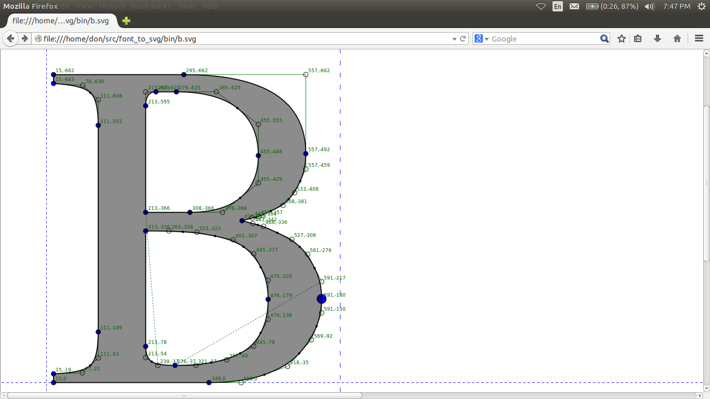
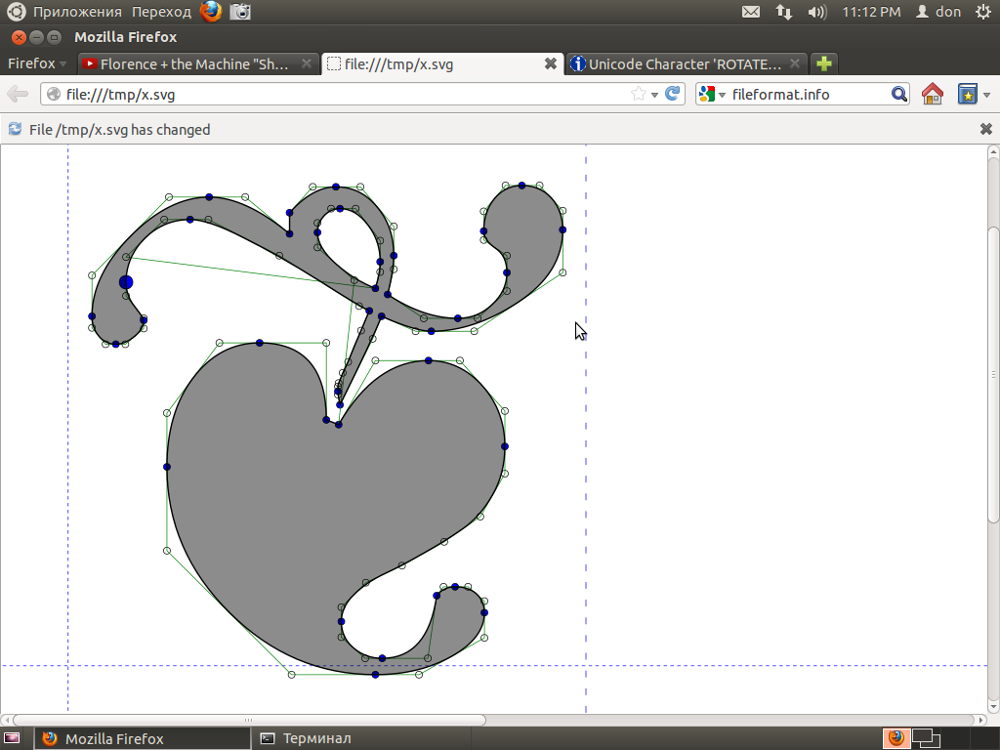

# TTF SVG Extractor

Gooborg Studios (www.gooborg.com) © 2018-2020, BSD-3-Clause License.
font_to_svg library: donbright <hugh.m.bright gmail.com> © 2013, BSD-3-Clause License. Modifications by Gooborg Studios (www.gooborg.com) © 2018-2020.

This program will convert all of the glyphs in a TrueType(R) font file into SVG 'path' shapes.

## Dependencies

- A C++17-compatible compiler
- CMake
- Python 3+
- [Freetype](https://www.freetype.org/) - required for lib
- [nlohmann_json](https://github.com/nlohmann/json)
- WxWidgets (later)

(macOS users: all of these dependencies are available via [Homebrew](https://brew.sh/))

## Build

This project uses CMake as its build tool.  A simple, standard `mkdir build; cd build; cmake ..; make -j8` will do the trick.

## API

This program also features an API written by [Don Bright](https://github.com/donbright/font_to_svg) with some modifications.  The API is a header library, so there is no need to compile the library for use.  Note, however, that the library depends on Freetype.

### Basic Usage

Let's say you have a TrueType font file, such as the popular 
FreeSans.ttf. Let's pull out the path information for the letter "B" and 
transform it into SVG. A simple C++ program code like the following can 
do that.

```c++
#include <font_to_svg.hpp>
int main() {
	font_to_svg::glyph g("FreeSans.ttf", 66);
	std::cout << g.svg();
}
```

Compile and run, and the program will generate an SVG path out of the 
TrueType information for the character of Unicode U+0066 (the Latin 
letter B), something like this:

```xml
<svg width='2684px' height='1519px' xmlns='http://www.w3.org/2000/svg' version='1.1'>
    <g fill-rule='nonzero' transform='translate(100 964)'>
        <rect fill='none' stroke='black' width='2683' height='1518'/>
        <path fill='black' stroke='black' fill-opacity='0.45' stroke-width='2' d='M 623,-208 Q 623,-114 564,-57 Q 505,0 408,0 L 79,0 L 79,-729 L 375,-729 Q 436,-729 481,-711 Q 526,-693 548,-663 Q 571,-634 581,-604 Q 591,-575 591,-544 Q 591,-432 490,-385 Q 560,-358 591,-316 Q 623,-274 623,-208 Z M 498,-415 M 498,-531 Q 498,-647 352,-647 L 172,-647 L 172,-415 L 352,-415 Q 498,-415 498,-531 Z M 399,-82 Q 448,-82 479,-103 Q 510,-125 520,-151 Q 530,-177 530,-207 Q 530,-264 496,-298 Q 462,-333 399,-333 L 172,-333 L 172,-82 L 399,-82 Z' />
</g>
</svg>
```

Open the resulting .svg 
file in a web browser and you get something like this:



Another example: Floral Heart, Unicode 0x2766:



### Current Status

This library has some bugs but will handle 'standard' fonts reasonably well.

The library is stable for basic use. It can output plain glyph shapes,
along with 'debugging' information like the node points & lines. 
There are some bugs with bounding boxes and other 'typographic box' 
issues like Bearing. Also calculation of the SVG "g" tag has some issues 
with transforms/footers.

The code does not currently support OpenType or its features, such as 
ligatures; it only does very basic conversion of Truetype glyphs to SVG path shapes. It might not be useful for web fonts or other usages.

### Using in Your Own Project

As mentioned above, `font_to_svg` is a header library, so you don't need to 
compile any libraries -- just include the header.

`font_to_svg` uses Freetype to deal with vaguaries and variations of 
Truetype file formats. The library does not use any of Freetype's bitmap 
font-rendering code; it is a pure "outline curve" renderer to be 
used for vector/curve based output.

### How It Works

Truetype fonts consist of a group of characters layed out in a file. The 
truetype file format is very complicated, with various issues related to 
character sets, glyph indexes, duplicated positions, etc etc etc. font_to_svg 
uses the Freetype library to make it easy to deal with those problems 
and to load the file into memory.

Each character in the Truetype file has a sequence of 'contours', which 
are basically a sequence of curves and lines that form a single shape. 
Some contours count as the 'body' of the letter, while others are the 
'holes' of a letter. The letter 'B' for example has a single contour for 
the 'outside' shape, and two 'hole' contours for the two inside shapes.

Truetype marks these contours in a special way - by the 'clockwise' ness 
of the order in which it lists the points that make up a contour. The 
contours that have their points in 'clockwise' order are considered 
'solid' The contours that have their points listed in 'counter 
clockwise' (also called 'anti-clockwise') order are considered 'holes'. 
For example, imagine the letter 'o'. The points making up the 'outside' 
contour are listed in clockwise order, while the points making up the 
'inside' contour are listed in counter-clockwise order.

But what type of points make up a contour? They are simple 2-dimensional 
Cartesian points with integer coordinates. The points for a contour are 
listed in order in the Truetype file. The curves and lines of a contour 
are drawn between the points using the rules of Bezier Curves. This 
means there are actually two different types of points - 'on the curve' 
points and 'off the curve' points. The 'on the curve' points actually 
have lines or curves coming out of them and/or touching them. 'Off the curve'
curves represent the 'control' points between the 'on the curve' points.

Now, Truetype doesn't just use any old Bezier curve. It uses a type of 
Bezier called 'Quadratic', which consists of two endpoints 'on the 
curve' and one 'control point'. If you check the Wikipedia article for 
Bezier Curve, http://en.wikipedia.org/wiki/B%C3%A9zier_curve , you can see simple animated examples. 

In this example, p0 is 'on the curve', p2 is also 'on the curve', but
p1 is 'off the curve'. In other words, p1 is a 'control point'.


_Image Source: [Wikipedia](https://en.wikipedia.org/wiki/B%C3%A9zier_curve#/media/File:B%C3%A9zier_2_big.gif)_

The math is not actually as complicated as it looks on the wiki page- 
you can draw a Bezier Quadratic using only a ruler and a pencil. I.E. 
you can actually do it without any transcendental functions or 
complicated algebra, just using simple ratios and integer math. But I 
digress.

Now... in Truetype there is a special feature in the way off-curve 
points are listed. If two are listed in a row, then there is actually a 
'hidden' or 'implied' on-curve point at a position exactly halfway 
between them. font_to_svg does not draw these points but they are easy to imagine
when looking at the debug code. 

Now. How does font_to_svg do SVG output? It basically just copies the point 
and contour information in the TrueType file and splits it into SVG 
paths. The actual rendering of the SVG file to something on a computer 
screen is left to the SVG rendering programs, like web browsers or 
Inkscape. The most complicated thing that these renderers do is probably 
the "non-zero winding rule", which is a geometry rule that determines 
how to properly draw the 'holes' and 'body' contours of a character 
glyph. font_to_svg doesn't have to worry about that either - it just inserts 
the svg property 'non-zero' fill-type into the generated SVG and the SVG 
renderer should take care of the rest.

Please see these sites for more info.

 * Basic Terms: http://www.freetype.org/freetype2/docs/glyphs/glyphs-3.html
 * FType + outlines: http://www.freetype.org/freetype2/docs/reference/ft2-outline_processing.html
 * FType + contours: http://www.freetype.org/freetype2/docs/glyphs/glyphs-6.html
 * TType contours: https://developer.apple.com/fonts/TTRefMan/RM01/Chap1.html
 * TType contours2: http://www.truetype-typography.com/ttoutln.htm
 * Non-zero winding rule: http://en.wikipedia.org/wiki/Nonzero-rule
 * SVG paths: http://www.w3schools.com/svg/svg_path.asp
 * SVG paths + nonzero: http://www.w3.org/TR/SVG/painting.html#FillProperties

## Other Projects

Sean Barret's amazing TTF parser + renderer:
https://github.com/nothings/stb/blob/master/stb_truetype.h

The "Batik" project does similar stuff in Java:

http://xmlgraphics.apache.org/batik/tools/font-converter.html

## Trademark Disclaimer

TrueType is a trademark of Apple, Inc. This library is not in any way 
affiliated nor endorsed by Apple, Inc. 
